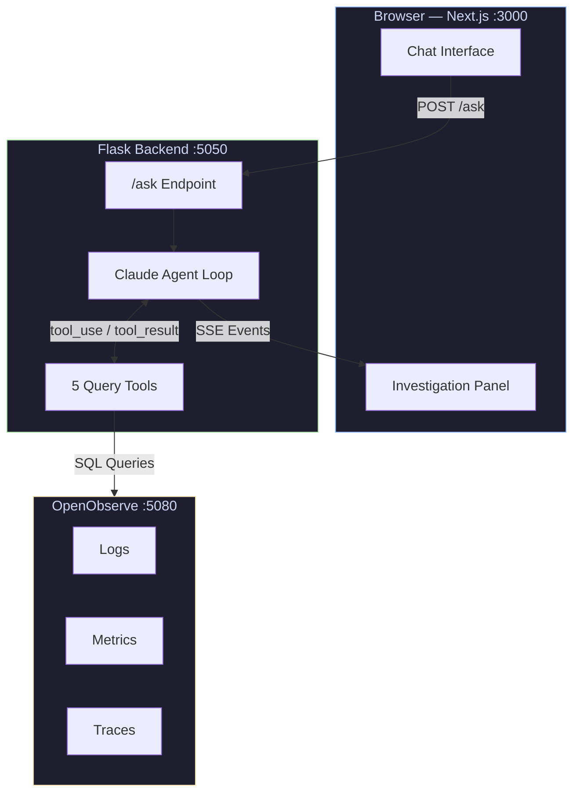
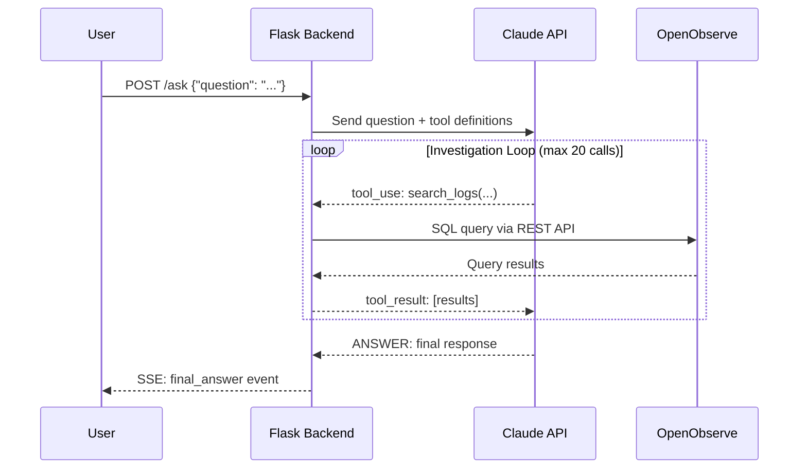
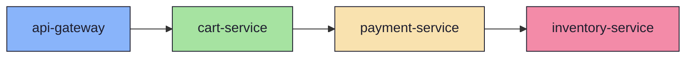

# TraceTalk

> Conversational root-cause analysis for infrastructure observability. Ask questions in plain English, watch an AI agent investigate live, and get evidence-grounded answers.


---

## What is TraceTalk?

TraceTalk replaces traditional query-builder UIs (PromQL, SPL, dashboards) with a **conversational investigation interface**. Instead of writing complex queries, you ask natural-language questions and watch an AI agent autonomously query your observability data across logs, metrics, and traces to find the root cause.

**Example questions:**
- *"Why did payment-service latency spike around 2pm?"*
- *"What caused the error spike in cart-service?"*
- *"What changed right before things went wrong, and which service is responsible?"*

---

## Key Features

| Feature | Description |
|---------|-------------|
| **Natural Language Investigation** | Ask questions in plain English — no query syntax needed |
| **Live Streaming** | Watch the agent's investigation steps in real-time via SSE |
| **Multi-hop Reasoning** | Agent autonomously chains evidence across services (metrics → service graph → logs → traces) |
| **Evidence Grounding** | Every claim traces back to a tool result — no hallucinated answers |
| **5 Query Tools** | `run_sql`, `list_streams`, `search_logs`, `get_metrics`, `get_service_graph` |
| **Tool-Use Budget** | Configurable cap (default: 20 tool calls per question) |
| **Dark Glassmorphism UI** | Modern, responsive interface with gradient accents and subtle animations |

---

## Architecture



### Data Flow



### Service Dependency Graph



---

## Tech Stack

### Backend
- **Python 3.13+** — Core runtime
- **Flask** — Web framework and API server
- **Anthropic Claude API** — AI reasoning engine with tool-use
- **OpenObserve** — Observability data platform (logs, metrics, traces)

### Frontend
- **Next.js 16.3** — React framework
- **React 19** — UI library
- **TypeScript 5** — Type safety
- **Tailwind CSS 4** — Styling
- **react-markdown** — Markdown rendering for AI responses
- **react-syntax-highlighter** — Code block highlighting

---

## Prerequisites

| Requirement | Details |
|-------------|---------|
| Python 3.13+ | `python3 --version` |
| Node.js 18+ | For Next.js frontend |
| Anthropic API Key | Get one at [console.anthropic.com](https://console.anthropic.com/) |
| OpenObserve | Running locally at `http://localhost:5080` with telemetry data |

---

## Getting Started

### 1. Set up environment variables

```bash
# Required — Anthropic API key
export ANTHROPIC_API_KEY=sk-ant-your-key-here

# Required — OpenObserve credentials
export ZO_ROOT_USER_EMAIL="your-email@example.com"
export ZO_ROOT_USER_PASSWORD="your-password"
```

### 2. Start the backend

```bash
python3 server.py
```

Backend runs at **http://localhost:5050**

### 3. Start the frontend

```bash
cd frontend
npm install
npm run dev
```

Frontend runs at **http://localhost:3000** (proxies API requests to Flask)

### 4. Start investigating

Open **http://localhost:3000** in your browser and ask a question!

---

## Project Structure

```
├── server.py               # Flask backend + SSE streaming endpoint
├── agent.py                # Claude tool-use agent loop
├── tools.py                # 5 query tools wrapping OpenObserve SQL
├── incident.py             # Real-time incident lab (continuous data)
├── metrics.py              # Alternative metrics/logs/traces generator
├── test_acceptance.py      # 5 acceptance test scenarios
│
├── frontend/               # Next.js frontend
│   ├── src/
│   │   ├── app/
│   │   │   ├── page.tsx           # Main chat page
│   │   │   ├── layout.tsx         # Root layout
│   │   │   └── globals.css        # Tailwind + glassmorphism styles
│   │   ├── components/
│   │   │   ├── ChatMessage.tsx    # Chat bubble + tool call display
│   │   │   └── MarkdownRenderer.tsx  # Syntax-highlighted markdown
│   │   ├── hooks/
│   │   │   └── useSSE.ts          # SSE streaming hook
│   │   └── types.ts               # TypeScript type definitions
│   └── next.config.ts             # API proxy configuration
│
├── static/                 # Legacy plain HTML/CSS/JS frontend
│   ├── index.html
│   ├── style.css
│   └── app.js
│
├── spec/                   # Detailed specifications
│   ├── overview.md
│   ├── datamodel.md
│   ├── toolsapi.md
│   ├── agentbehaviour.md
│   ├── ui.md
│   └── acceptancecriteria.md
│
├── prd.md                  # Product Requirements Document
├── tech.md                 # Technical Design Document
└── plan.md                 # Build plan
```

---

## Configuration

### Environment Variables

| Variable | Default | Description |
|----------|---------|-------------|
| `ANTHROPIC_API_KEY` | *required* | Anthropic API key for Claude |
| `OO_BASE_URL` | `http://localhost:5080` | OpenObserve instance URL |
| `OO_ORG` | `default` | OpenObserve organization |
| `ZO_ROOT_USER_EMAIL` | *required* | OpenObserve auth username |
| `ZO_ROOT_USER_PASSWORD` | *required* | OpenObserve auth password |

### Agent Settings (in `agent.py`)

| Setting | Value | Description |
|---------|-------|-------------|
| Model | `claude-opus-5` | AI reasoning model |
| Max tool calls | 20 | Budget cap per question |
| SSE timeout | 5 min | Frontend stream timeout |

---

## Running Tests

```bash
python3 test_acceptance.py
```

Runs 5 acceptance scenarios:
1. **Latency spike investigation** — single-hop: metrics → traces → root cause
2. **Error burst analysis** — deploy log discovery → causal chain
3. **Multi-hop reasoning** — scan → service graph → drill down
4. **Negative test** — handles ambiguous/irrelevant questions gracefully
5. **Performance** — completes within time constraints

Requires `ANTHROPIC_API_KEY` to be set.

---

## Demo Questions

| Question | Investigation Path |
|----------|--------------------|
| *"Why did payment-service latency spike around 2pm?"* | Metrics → Traces → Root cause (downstream timeout) |
| *"What caused the error spike in cart-service?"* | Logs → Deploy event → Bad release identified |
| *"What changed right before things went wrong?"* | Multi-service scan → Service graph → Dependency failure |

---

## Constraints

- **No hallucinated answers** — every agent claim must trace back to a tool result
- **Transparent investigation** — all reasoning steps are visible in the side panel
- **Budget-bounded** — tool calls are capped to prevent runaway costs
- **Evidence-first** — the agent never guesses; it queries and reasons over real data

---

## License

MIT
